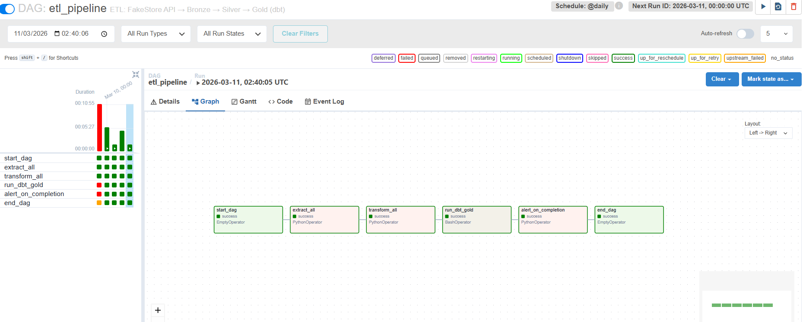
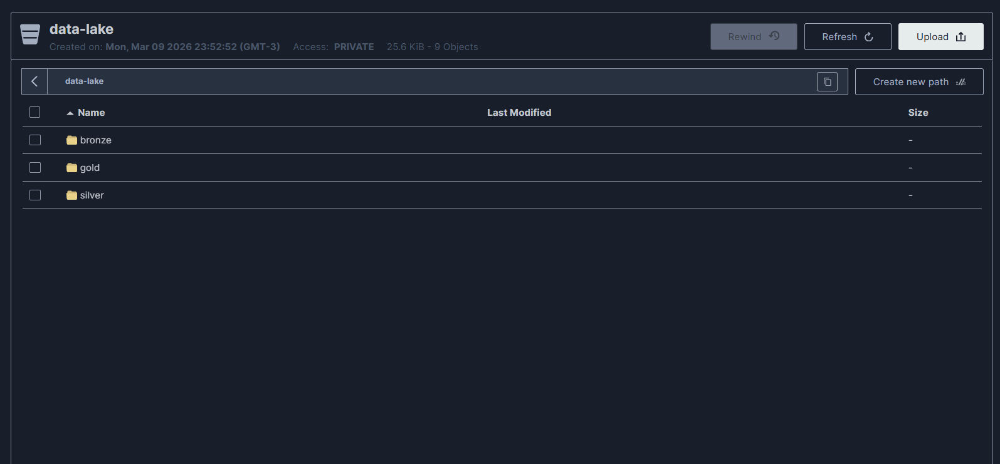
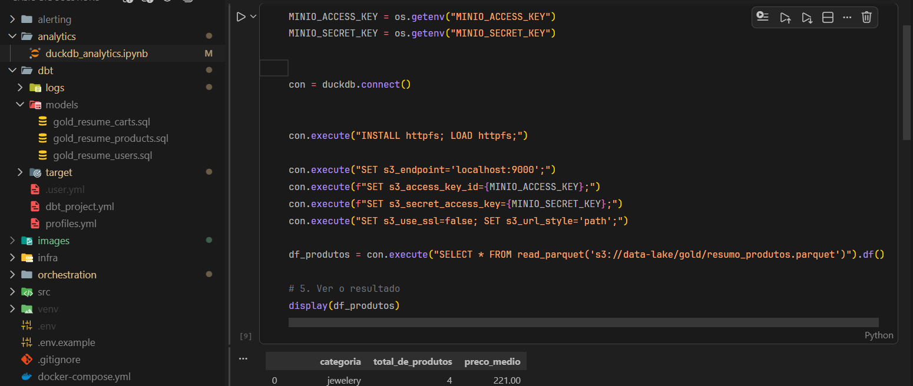
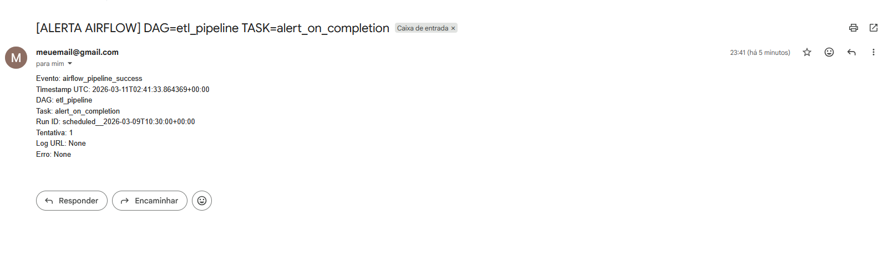

# Basic ETL Solutions

## Descrição

Este projeto implementa uma solução ETL (Extract, Transform, Load) básica e completa, utilizando tecnologias modernas para processamento de dados. O pipeline extrai dados da API FakeStore, transforma-os em camadas (Bronze, Silver, Gold) e os armazena em um data lake baseado em MinIO. A orquestração é feita com Apache Airflow, e a camada Gold é gerenciada com DBT (Data Build Tool) usando DuckDB. Inclui sistema de alertas via RabbitMQ e email para monitoramento de falhas e sucessos.

### Funcionalidades Principais

- **Extração**: Dados de produtos, usuários e carrinhos da API FakeStore.
- **Transformação**: Limpeza e estruturação dos dados em camadas.
- **Armazenamento**: Data lake com MinIO (compatível com S3).
- **Orquestração**: DAGs automatizados no Airflow.
- **Modelagem**: Camada Gold com DBT e DuckDB.
- **Alertas**: Notificações por email em caso de falhas ou sucessos.
- **Análises**: Notebook Jupyter para exploração de dados com DuckDB.

## Arquitetura

O projeto segue uma arquitetura de data lakehouse com camadas:

- **Bronze**: Dados brutos extraídos da API, armazenados como JSON no MinIO.
- **Silver**: Dados transformados e limpos, salvos como CSV no MinIO.
- **Gold**: Dados agregados e modelados, salvos como Parquet no MinIO via DBT.

### Componentes
- **RabbitMQ**: Mensageria para alertas.
- **MinIO**: Armazenamento de objetos (data lake).
- **Airflow**: Orquestração de pipelines ETL.
- **DBT**: Transformações e modelagem de dados.
- **DuckDB**: Banco de dados analítico para processamento.
- **Jupyter Notebook**: Análises exploratórias.

## Pré-requisitos

- Docker e Docker Compose
- Conta Gmail para alertas (opcional, mas recomendado para notificações por email)
- Variáveis de ambiente para credenciais (ver seção de configuração)

## Instalação e Execução

1. **Clone o repositório**:
   ```bash
   git clone https://github.com/seu-usuario/basic-etl-solutions.git
   cd basic-etl-solutions
   ```

2. **Configure as variáveis de ambiente**:
   Crie um arquivo `.env` na raiz do projeto com as seguintes variáveis:
   ```env
   MINIO_ROOT_PASSWORD=your_minio_password
   ALERT_SMTP_USER=your_gmail@gmail.com
   ALERT_SMTP_PASS=your_gmail_app_password
   ALERT_FROM_EMAIL=your_gmail@gmail.com
   ALERT_TO_EMAIL=recipient@example.com
   ```

3. **Execute os serviços**:
   ```bash
   docker-compose up --build
   ```

4. **Acesse as interfaces**:
   - **Airflow**: http://localhost:8080 (usuário: admin, senha: admin)
   - **MinIO**: http://localhost:9001 (usuário: admin, senha: definida no .env)
   - **RabbitMQ**: http://localhost:15672 (usuário: admin, senha: admin)

5. **Execute o pipeline**:
   No Airflow, ative e execute o DAG `etl_pipeline`.

## Estrutura do Projeto

```
basic-etl-solutions/
├── alerting/                    # Sistema de alertas
│   ├── consumer/
│   │   └── airflow_callback.py  # Callbacks para Airflow
│   └── producer/
│       └── email_notifier.py    # Notificador por email
├── analytics/                   # Análises exploratórias
│   └── duckdb_analytics.ipynb   # Notebook Jupyter com DuckDB
├── dbt/                         # Configuração DBT
│   ├── models/                  # Modelos SQL para camada Gold
│   │   ├── gold_resume_carts.sql
│   │   ├── gold_resume_products.sql
│   │   └── gold_resume_users.sql
│   ├── dbt_project.yml
│   └── profiles.yml
├── infra/                       # Infraestrutura Docker
│   ├── airflow/
│   │   └── dockerfile
│   ├── alert-consumer/
│   │   └── dockerfile
│   ├── minio/
│   │   └── dockerfile
│   └── rabbitmq/
│       └── dockerfile
├── orchestration/               # Orquestração Airflow
│   └── airflow/
│       ├── dags/
│       │   └── etl_dag.py       # DAG principal ETL
│       └── variables/
├── src/                         # Scripts ETL
│   └── script/
│       ├── extract/
│       │   └── extraction.py    # Scripts de extração
│       └── transformation/
│           └── silver_transformation.py  # Scripts de transformação
├── docker-compose.yml           # Configuração Docker Compose
├── requirements.txt             # Dependências Python
└── README.md                    # Este arquivo
```

## Como Usar

### Executar Extração Manual
Para testar a extração individualmente:
```python
from src.script.extract.extraction import extract_products
extract_products()
```

### Executar Transformação Manual
```python
from src.script.transformation.silver_transformation import transform_products
transform_products()
```

### Executar DBT
```bash
cd dbt
dbt run --profiles-dir .
```

### Análises no Notebook
Abra `analytics/duckdb_analytics.ipynb` no Jupyter e execute as células para explorar os dados Gold.


## Configuração de Alertas

Os alertas são enviados por email quando:
- Uma tarefa do Airflow falha
- O pipeline ETL é concluído com sucesso

Configure as variáveis SMTP no `.env` para habilitar.

Para executar o consumidor de alertas separadamente:
```bash
docker-compose up alert-consumer
```

## Desenvolvimento

### Adicionar Novos Dados
1. Adicione funções de extração em `src/script/extract/extraction.py`
2. Crie transformações em `src/script/transformation/silver_transformation.py`
3. Adicione modelos DBT em `dbt/models/`
4. Atualize o DAG em `orchestration/airflow/dags/etl_dag.py`

### Testes
Execute testes locais com:
```bash
python -m pytest
```

### Logs
- Airflow: `/opt/airflow/logs`
- DBT: `dbt/logs`

## Contribuição

1. Fork o projeto
2. Crie uma branch para sua feature (`git checkout -b feature/nova-feature`)
3. Commit suas mudanças (`git commit -am 'Adiciona nova feature'`)
4. Push para a branch (`git push origin feature/nova-feature`)
5. Abra um Pull Request

## Licença

Este projeto está sob a licença MIT. Veja o arquivo LICENSE para mais detalhes.

## Suporte

Para dúvidas ou problemas, abra uma issue no GitHub ou entre em contato com a equipe de desenvolvimento.